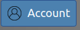

# Account Management
<<<<<<< HEAD

```{contents}
:local:
```

Marble nodes use an account management, authorization, and authentication service called 
[Magpie](https://pavics-magpie.readthedocs.io). This system is primarily used by node administrators to manage account
permissions but can also be used by users to manage their personal account information.

## Login to the account management portal

The Magpie service is available at the `/magpie` endpoint of each node. For example, if the main URL of a node is
`https://mynode.example.com` then Magpie service is available at `https://mynode.example.com/magpie`.

Navigate to this URL and click the "Log In" button at the top of the page:


Log in with your username and password and then click the "Account" button at the top of the page:



From this page you will be able to do any of the following:

### Change your password

Click the "Edit" button beside the "Password" field and enter a new password into the text box and click "Save".

```{note}
Some nodes may have restrictions on passwords. If a password that you have entered is invalid, a warning message will 
be shown indicating how to create a valid password.
```

### Change your email address

Click the "Edit" button beside the "Email" field and enter a new email address into the text box and click "Save".

### Delete your account

Click the "Delete Account" button. You will be asked to confirm that you would like to delete your account since once
you delete your account it cannot be recovered.

```{warning}
Please be absolutely sure that you would like to have all of your account information and any data associated with your
account deleted before continuing with this step!
```
