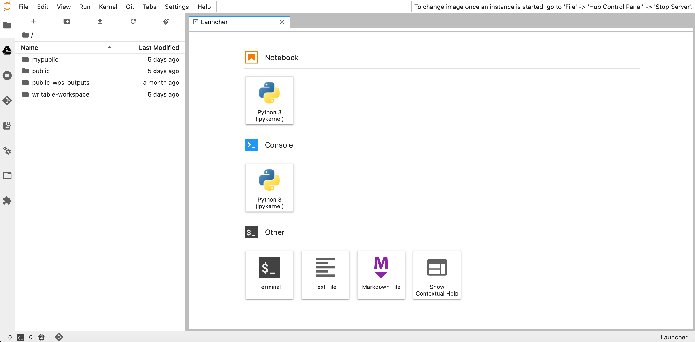
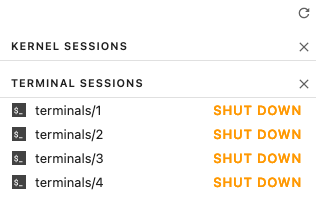
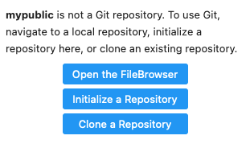
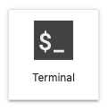
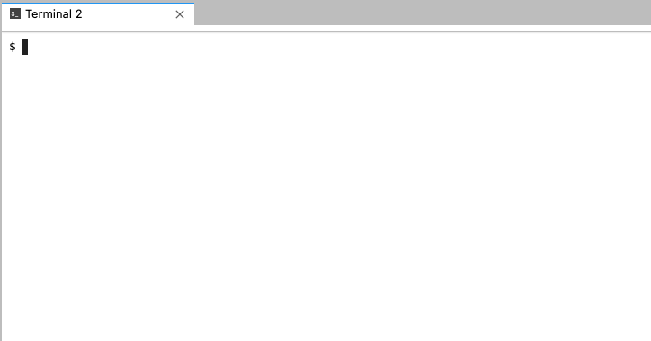
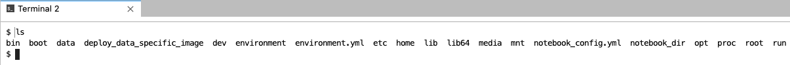
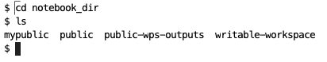
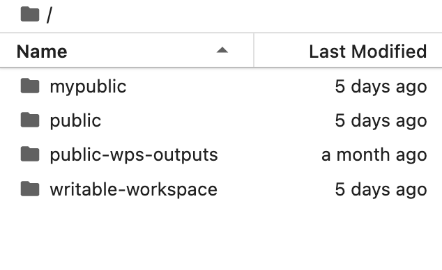
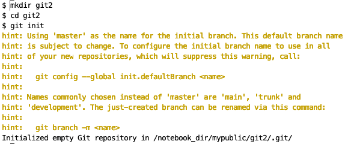

# Getting Started

## Table of Contents
- [The Login Screen](#login-screen)
- [Logging In](#logging-in)
- [Account Management](#account-management)
  - [Creating An Account](#creating-account)
  - [Account Details](#account-details)
- [Main Areas of the Platform](#main-areas)
  - [JupyterLab](#jupyterlab)
- [Navigating the Interface](#navigating-interface)
- [Setting up a Git Repository](#setup-git)


## <a id="login-screen"></a>The Login Screen

After clicking on a link to a node from the Marble website you will be brought to the login screen for that node.  


Enter your login credentials and click `Sign In`.  

## <a id="account-management"></a>Account Management
Account management is handled by Magpie, the authorization service of the Marble platform.

The Magpie homepage can be found at this [link](https://daccs.cs.toronto.edu/magpie/)

### <a id="creating-account"></a>Creating an Account
If you don't have login credentials contact the admin team for that particular node for a 
login.  For example, displayed at the top of the U of T node's login page is the contact email for information on how to create an account.

### <a id="account-details"></a>Account Details
Account details can be accessed at the [Magpie homepage](https://daccs.cs.toronto.edu/magpie/)


## <a id="main-areas"></a>Main Areas of the Platform
### <a id="jupyterlab"></a>JupyterLab
### <a id="navigating-interface"></a>Navigating the Interface
### Server Selection
Once logged in you will see a dropdown list of the images available on the particular node. What is available will differ from node to node.

Select the one you want and click `Start`.


### Home Screen - JupyterLab
When it finishes loading you will be presented with a JupyterLab home screen.



### Menus
#### Left Sidebar
The left sidebar consists of icon buttons that give quick access to features.

|                                                                                                       |                    |                                                                                                |
|-------------------------------------------------------------------------------------------------------|--------------------|------------------------------------------------------------------------------------------------|
|                     | Google Drive       |                                                                                                |
|                      | Terminal           | Lists the Kernel and Terminal session currently running                                        |
|                                | Git                | Lists the repositories currently available<br/> See: [Setting up a Git repository](#setup-git) |
|                      | Commands           |                                                                                                |
|  | Property Inspector |                                                                                                |
|                    | Open Tabs          |                                                                                                |
|    | Extensions         |                                                                                                |


#### Terminal and Kernel Sessions

The Terminal button shows the Terminal and Kernel sessions currently running.  You can switch between the current running Terminals and Kernels and also shut them down.




#### <a id="setup-git"></a>Setting up a Git Repository 
##### Setup Git Repository Using the Graphical User Interface

If there is no Git repository set up you will see the following:



Click `Initialize Repository` to create a Git repository in the current folder. 

> [!NOTE]
> 
> The current folder is the last one shown in the folder breadcrumb.
> 
>  
> 
> For example, if `mypublic` is the last one in the breadcrumb, then `mypublic` is the current folder selected 

Once it is done the left sidebar will show the Git interface.  This is where you will see changes to files in the Git folder.


##### Setup Git Repository Using the Jupyter Terminal

Click the Terminal button to start a Terminal session.





Check to see that you are in the default folder by executing the `ls` command.

```
ls
```

If you are in the default folder you will see the following subfolders available to you:



Navigate into the `notebook_dir` directory.

```
cd notebook_dir
```
You should see the public folders available to you.  These are the same folders seen when clicking the `File Browser` icon.




Navigate into the `mypublic` folder, then create a new folder here and then navigate into it.

Substitute `your-folder-name` with a new folder name. 

```
cd mypublic

mkdir your-folder-name

cd your-folder-name
```
Initialize your Git repository

```
git init
```


