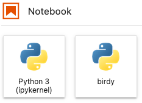
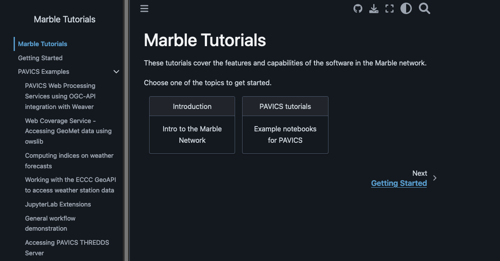

# Getting Started

## Table of Contents

- [Main Areas of the Platform](#main-areas)
  - [Finding a Node](#find-node)
  - [Server Selection](#server-selection)
  - [JupyterLab](#jupyterlab)
  - [The Data Catalog](#data-catalog)
  - [Tutorials](#tutorials)
- [Account Management](#account-management)
  - [Creating An Account](#creating-account)
  - [Account Details](#account-details)
- [Logging In](#logging-in)

## Main Areas of the Platform

### Finding a Node
From the [Marble Climate homepage](https://marbleclimate.com/index.html) click one of the entries describing a node.

You will be taken to the node information which lists the services available on that node and contains the link to that node. 

Click on the link to go to the landing page of that node.

### Server Selection
Once logged in you will see a dropdown list of the images available on the particular node. What is available will differ from node to node.

Select the one you want and click `Start`.

### JupyterLab
JupyterLab will be the main area where you will be doing your work.  Start a notebook by clicking the `Python 3` button or `birdy` button (if available) under the Notebook section. 

### The Data Catalog
The Data Catalog is where the data on each node can be found.  

From the [Marble Climate](https://marbleclimate.com) website. Click the `Data Catalog` link.  On the **Data Catalog** page select the node whose data you wish to browse.  You will then be taken to the STAC Browser for that node.

### Tutorials

Tutorials are available from the [Marble Climate](https://marbleclimate.com) website from the `Tutorials` menu link.

Here you will find examples of how to use Marble and the services provided on Marble to conduct data analysis.

## Account Management
Account management is handled by Magpie, the authorization service of the Marble platform.

The Magpie homepage can be found at this [link](https://daccs.cs.toronto.edu/magpie/)

### Creating an Account
If you don't have login credentials contact the admin team for that particular node for a 
login.  For example, displayed at the top of the U of T node's login page is the contact email for information on how to create an account.

### Account Details
Account details can be accessed at the [Magpie User Management](https://daccs.cs.toronto.edu/magpie/) page

### Changing Your Password

After logging into the Magpie User Management click the `Account` button to display the **Account User** page.  Next to **Password** click the `Edit` button to change the password.

## Logging In

After clicking on a link to a node from the Marble website you will be brought to the login screen for that node.  
Some may use JupyterHub as a login screen, some may have their own custom login screen.  

Enter your login credentials and click `Sign In`.  

