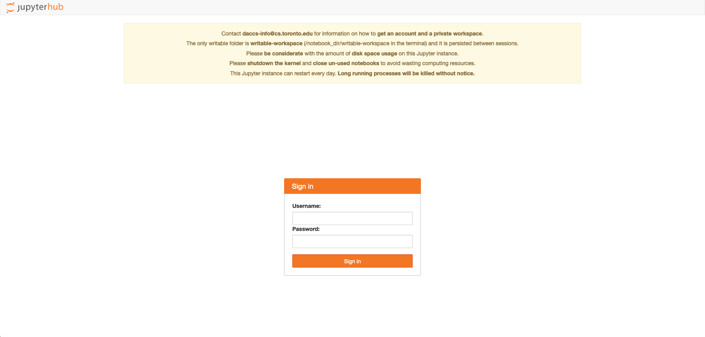

# Getting Started

## Table of Contents
- [Main Areas of the Platform](#main-areas)
  - [Server Selection](#server-selection)
  - [JupyterLab](#jupyterlab)
- [Logging In](#logging-in)
- [Account Management](#account-management)
  - [Creating An Account](#creating-account)
  - [Account Details](#account-details)
- [Version Control](https://github.com/DACCS-Climate/marble-tutorials/blob/alex-tutorials/tutorials/marble/version-control.md#version-control)

## Logging In

After clicking on a link to a node from the Marble website you will be brought to the login screen for that node.  
Some may use JupyterHub as a login screen, some may have their own custom login screen.  

Enter your login credentials and click `Sign In`.  

## Account Management
Account management is handled by Magpie, the authorization service of the Marble platform.

The Magpie homepage can be found at this [link](https://daccs.cs.toronto.edu/magpie/)

### Creating an Account
If you don't have login credentials contact the admin team for that particular node for a 
login.  For example, displayed at the top of the U of T node's login page is the contact email for information on how to create an account.

### Account Details
Account details can be accessed at the [Magpie homepage](https://daccs.cs.toronto.edu/magpie/)

## Main Areas of the Platform
### Server Selection
Once logged in you will see a dropdown list of the images available on the particular node. What is available will differ from node to node.

Select the one you want and click `Start`.

### JupyterLab
[JupyterLab](https://jupyterlab.readthedocs.io) will be our primary method for your 
interactions with the Marble Platform. JupyterLab contains a complete environment for
interactive scientific computing which runs in your web browser. Jupyter is an
open source python project that was started by scientists like yourselves who
wanted a more effective way to interact with their computers. While Jupyter notebooks cannot 
be used for productionized products, they allow for more readable and understandable projects.
Perfect for Exploratory Data Analysis, Modelling and Experimentation. 

JupyterLab has excellent documentation. Rather than repeat that documentation
here, we point you to their docs. The following pages are particularly relevant:

- [The JupyterLab Interface](https://jupyterlab.readthedocs.io/en/stable/user/interface.html)
- [Working with Files](https://jupyterlab.readthedocs.io/en/stable/user/files.html)
- [The Text Editor](https://jupyterlab.readthedocs.io/en/stable/user/file_editor.html)
- [Notebooks](https://jupyterlab.readthedocs.io/en/stable/user/notebook.html)
- [Terminals](https://jupyterlab.readthedocs.io/en/stable/user/terminal.html)
- [Managing Kernels and Terminals](https://jupyterlab.readthedocs.io/en/stable/user/running.html)

