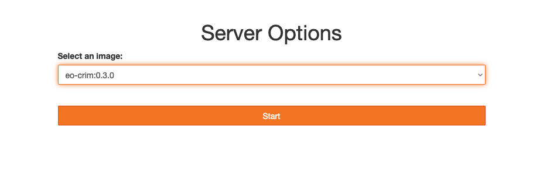
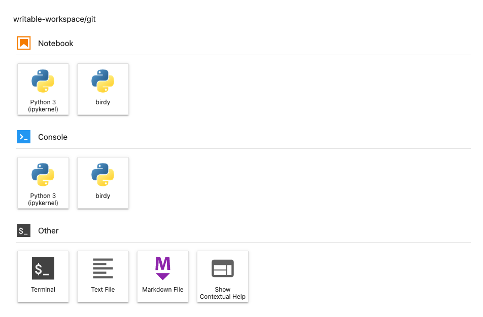
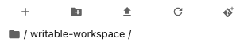
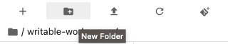
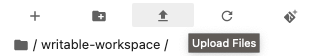
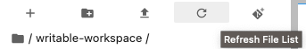
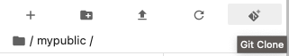

# How to Use

## Jupyter Images
An image is a portable configuration of a computing instance; a snapshot of a computing environment at a point in time.

If the server you are connected to has Jupyter installed you will see a dropdown list of Jupyter images after logging 
in to the server.  Each image has a different configuration of software for a specific use case.  For example, the 
"eo-crim" image has Python packages installed for Earth Observation while other images do not. 


## Server Selection
Once logged in you will see a dropdown list of the images available on the particular node. What is available will differ from node to node.

Select the one you want and click `Start`.



```{note}
Each Jupyter image in this list provides a different configuration of Python packages.  Some Python packages may not be installed on all Jupyter images.
``` 


## The User Interface

The user interface of Jupyter Lab is divided into three general areas: the launcher, the breadcrumb menu, and the left menu.

The launcher displays icons of the different environments that can be run.  These include Jupyter Notebooks and 
console shells.




The breadcrumb menu contains some useful shortcut buttons and displays the folder path you are browsing.




The left menu contains shortcuts and displays additional information or actions you can take.

| Left Menu Icon                                                                   | Purpose                                                                                                                                    |
|----------------------------------------------------------------------------------|--------------------------------------------------------------------------------------------------------------------------------------------|
|                          | Displays the folders accessible to you                                                                                                     |
|                      | Displays the kernel (Jupyter Notebook) and terminal sessions currently open. <br> You can shut down kernel and terminal sessions from here. |
|                                | Displays the Git actions that can be taken. (only available inside a Git repository)                                                       |
|                      | Displays useful commands you can run without needing to go through the top menu                                                            |
|  | Lets you look inside the tags of a Jupyter notebook                                                                                        |
|                    | Displays a list of tabs currently running.  Tabs can be shut down from here.                                                               |
|    | Displays any third-party extensions installed                                                                                              |


## Creating Folders

To create a folder click the `New Folder` button in the shortcut bar above the breadcrumb.

This will create a new folder in the folder shown in the breadcrumb. 



## Upload Files

To upload files click the `Upload Files` button in the shortcut bar above the breadcrumb.
The file will be uploaded to the folder shown in the breadcrumb. 



## Refresh File List

If a newly created folder or recently uploaded file is not seen in the list try refreshing it by click the `Refresh File List` button.




## Git Clone



A shortcut for cloning a remote git repository.

```{note}
This button only becomes active when you are in a folder that does not contain a git repository.
``` 


## Folder Types

When you click the `Folder` icon you will see there are some folders already created.  These are default folders in Marble that allow the user to store files and share files with other users.

| Folder  Name                                                                     | Purpose                                                                                                                                               |
|----------------------------------------------------------------------------------|-------------------------------------------------------------------------------------------------------------------------------------------------------|
| mypublic                                                                         | This is the user's public folder.  Files in this folder will be viewable by anyone in the node.                                                       |
| public                                                                           | This shows the public folder of every user on the node.  <br> This folder is viewable by everyone and the files inside it can be accessed by everyone. |
| public-wps-outputs                                                               | This folder is used to hold the results of web processing services. <br> This folder is viewable by everyone.                                         |
| writable-workspace                                                               | This is the user's private workspace.                                                                                                                 |

