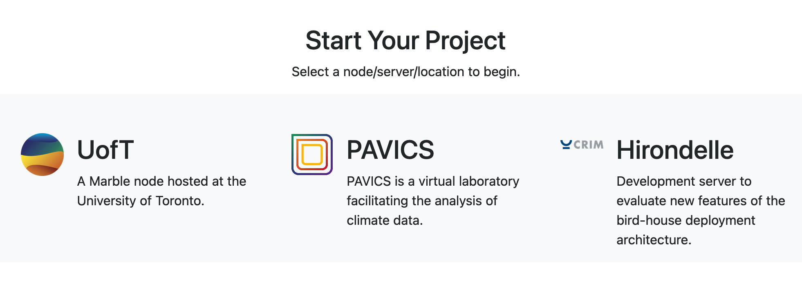

  - [Finding a Node](#find-node)
  -   - [Server Selection](#server-selection)

### Finding a Node
Under the "Start Your Project" section in the [Marble Climate homepage](https://marbleclimate.com/index.html) 
is a list of every node in the Marble network. Click one of the entries in the "Start Your Project" section.

You will be taken to the node information which lists the services available on that node and contains the link to that node. 

Click on the link to go to the landing page of that node.

### Server Selection
Once logged in you will see a dropdown list of the images available on the particular node. What is available will differ from node to node.

Select the one you want and click `Start`.

