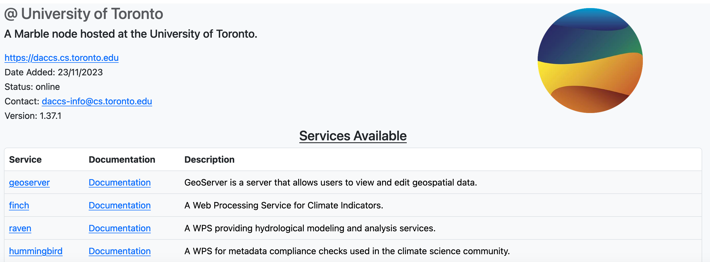

- [Finding a Node](#find-node)

## Finding a Node
Under the "Start Your Project" section in the [Marble Climate homepage](https://marbleclimate.com/index.html) 
is a list of every node in the Marble network. Click one of the entries in the "Start Your Project" section.

You will be taken to the node information which lists the services available on that node and contains the link to that node. 

Click on the link to go to the landing page of that node.

