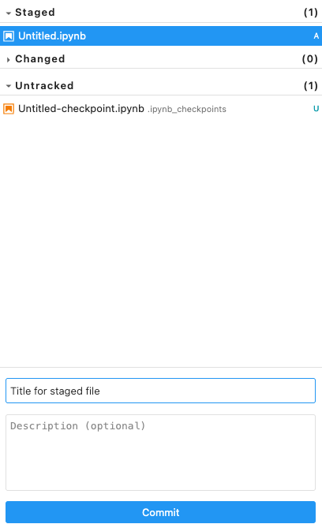
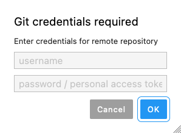
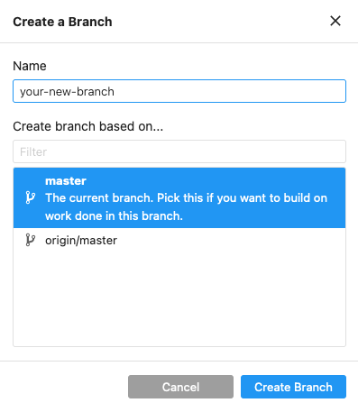
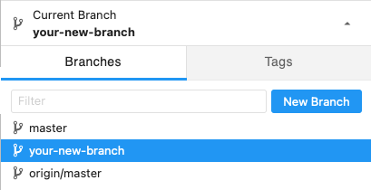

# Version Control

Version control is a useful tool in any workflow.  It allows you to work on copies of your work and make changes to them without affecting the original.


## Table of Contents
- [Introduction to Git](#intro-git)
- [Git Best Practices](#best-practices)
- [Setting up a Git Repository](#setup-git)
  - [Creating a GitHub Account](#github-account)
  - [Creating a Remote Repository](#remote-repository)
  - [Creating a Personal Access Token](#personal-access-token)
  - [Setting up using the Graphical User Interface](#setup-git-gui)
    - [Adding a Remote Repository](#add-remote-gui)
    - [Creating a Local Repository](#local-repository-gui)
  - [Setting up using the Terminal](#setup-git-terminal)
    - [Adding a Remote Repository](#add-remote-terminal)
    - [Creating a Local Repository](#local-repository-terminal)
- [Using Git](#using-git)
  - [Using Git with the Graphical User Interface](#using-git-gui)
    - [Making Your First Commit](#first-commit)
    - [Staging a Commit](#stage-gui)
    - [Making a Commit](#commit-gui)
    - [Pushing a Commit](#push-gui)
    - [Creating a Branch](#create-branch-gui)
  - [Using Git with the Terminal](#using-git-terminal)
    - [Staging a Commit](#stage-terminal)
    - [View Staged Files](#view-stage-terminal)
    - [Making a Commit](#commit-terminal)
    - [Pushing a Commit](#push-terminal)
    - [Creating a Branch](#create-branch-terminal)
- [Creating a Pull Request](#create-pr)
- [Merging Your Branch](#merge-branch)

## <a id="intro-git"></a>Introduction to Git

Git is one of the most popular version control systems in use today. It has a native commandline interface but also has 
a desktop GUI client for Windows and MacOS.  The online GitHub website allows you to store your repository online and access it anywhere with a free account. 

## <a id="best-practices"></a>Git Best Practices

### Organize with Branches

Create a branch for each issue you're working on.  Have one for data ingestion, one for visualization, and one for bug fixes.

This keeps the workflow clean.  If something went wrong you know which branch the changes came from.

### Write Descriptive Commit Messages

A good commit message documents the changes made in the commit so that when looking through the commits you can see the direction your work is going in.

### Commit finished tasks only

Each commit should be a completed logical chunk of the overall workflow.  If you need to commit often, split up the workflow into smaller tasks.

### Test code before committing

Related to only committing finished tasks, test your code to ensure it does what it is intended to do before committing.

## <a id="setup-git"></a>Setting up a Git Repository 

[GitHub Desktop Client](https://desktop.github.com/)

### <a id="github-account"></a>Creating a GitHub Account
To begin using Git you need to create a free account on [GitHub](https://github.com/).  
Go to the GitHub website and follow the instructions to create an account. 

### <a id="remote-repository"></a>Creating a Remote Repository

After creating account click `Repository` at the top menu and then `New`


Fill in the form with the details of the repository and click the `Create Repository` button at the bottom of the page.

### <a id="creating-pat"></a>Creating a Personal Access Token

A Personal Access Token is used to authenticate the user when pushing files to the remote repository

Go to [GitHub](https://github.com/) and log into your account.

Click on: **Your User Profile** &rarr; **Settings** &rarr; **Developer Settings** &rarr; **Personal Access Token** &rarr; **Generate New Token or Tokens(classic)**

Choose an expiration date.  Check all the boxes in the form.  Click **Generate Token**. Copy the generated token.


### <a id="setup-git-gui"></a>Setup Git Repository Using the Graphical User Interface

If there is no Git repository set up you will see the following:


### <a id="add-remote-gui"></a>Adding a Remote Repository

Adding a remote repository allows you to store your work online at GitHub and access it anywhere.

From the menu click `Git` and then select `Add Remote Repository`.  Enter the URL of the repository you created on 
GitHub into the `Add Remote Repository` dialog box.  Click `OK` 

### <a id="local-repository-gui"></a>Creating a Local Repository
Click `Initialize Repository` to create a Git repository in the current folder. 

> [!NOTE]
> 
> The current folder is the last one shown in the folder breadcrumb.
> 
>  
> 
> For example, if `mypublic` is the last one in the breadcrumb, then `mypublic` is the current folder selected 

Once it is done the left sidebar will show the Git interface.  This is where you will see changes to files in the Git folder.


### <a id="setup-git-terminal"></a>Setup Git Repository Using the Jupyter Terminal

Click the Terminal button to start a Terminal session.


Check to see that you are in the default folder by executing the `ls` command.

```
ls
```

If you are in the default folder you will see the following subfolders available to you:


Navigate into the `notebook_dir` directory.

```
cd notebook_dir
```
You should see the public folders available to you.  These are the same folders seen when clicking the `File Browser` icon.


Navigate into the `mypublic` folder, then create a new folder here and then navigate into it.

Substitute `your-folder-name` with a new folder name. 

```
cd mypublic

mkdir your-folder-name

cd your-folder-name
```
Initialize your Git repository

```
git init
```


### <a id="add-remote-terminal"></a>Adding a Remote Repository
```
git remote add origin url-of-your-git-repository
```

## <a id="using-git"></a>Using Git
### <a id="using-git-gui"></a>Using Git with the Graphical User Interface
By default when you create a new repository you will be using the **master** branch.
This is the main branch where the initial work files will be pushed to and also where the final work version will be.

It is good practice to create work branches from the master branch where all the changes to your work will be done.
Once the changes are complete they can be pushed and merged with the master branch

### <a id="first-commit"></a>Making Your First Commit

Start by creating a file.  In this example a Jupyter Notebook file is created by clicking one of the Jupyter Notebook buttons in the launcher.


When the file is created or altered it will be seen under the `Untracked` section in the Git sidebar.


### <a id="stage-gui"></a>Staging a File

To get the file ready to be committed and pushed, hover the mouse over the file and click the plus `+` symbol next to it.  This **Stages** the file.


The file will now appear under the `Staged` section.


### <a id="commit-gui"></a>Making a Commit

Select the file and fill in the Title/Summary for the commit.  It should be short and descriptive.  
It can be as simple as "Updated Untitled.ipynb" or more specific, such as "Added visualization for rainfall 2022".

A description is recommended but is not required.



When done click the `Commit` button below the commit description.  If successful you will see a `Committed changes` status pop up in the lower right corner.


### <a id="push-gui"></a>Pushing a Commit

Making a commit sets a "flag" in the progress of your work that shows what has been done at certain points. Pushing a commit moves these changes to the remote 
repository where they can be merged with the master/main branch.  Up to now no branches have been made.

Click the `Git` menu and `Push to Remote`


Enter in your login credentials.  For the password enter your Personal Access Token.  Click `OK`.




If successful you will see a `Successfully pushed` status pop up in the lower right corner.


### <a id="create-branch-gui"></a>Creating a Branch

Click the down arrow in the `Current Branch` section in the Git sidebar.  It will reveal the `Branches` window and show all the created branches.

Click the `New Branch` button.


Fill out the form and input a branch name, and click which branch to base the new branch off of.  After that click `Create Branch`.

It is good practice to not use spaces or special characters in the branch name other than dashes.




Git will automatically switch you into the new branch.  Your newly created branch will be shown under `Current Branch` and be in the list of branches.  




### <a id="using-git-terminal"></a>Using Git with the Terminal

### Set Up Your Git Identifier

If you are working in a team this will show who made a certain commit.

```
git config --global user.name "Your Name"
git config --global user.email "email@email.com"
```

### <a id="stage-terminal"></a>Staging a File

Make sure you are in the same directory as the file you want to stage.

```
git add <filename>
```

### <a id="view-stage-terminal"></a>View Staged Files

If you have multiple files staged and ready to commit you can see the list by using `git status`.

```
git status
```


### <a id="commit-terminal"></a>Making a Commit

Add a brief descriptive message about your commit.

```
git commit -m "your brief commit message goes here"
```

### <a id="push-terminal"></a>Pushing a Commit

After your commit is complete, push it to the remote repository

```
git push
```

### <a id="create-branch-terminal"></a>Creating a Branch

```
git branch <new-branch-name>
```


## <a id="create-pr"></a>Creating a Pull Request
A Pull Request is done when you want to merge your changes into the **master**/**main** branch.  It also gives you a chance to let others know of the changes you made and ask them to review your changes.

A Pull Request is done from the GitHub site.  After logging into [GitHub](https://www.github.com), you may see a notification about a branch making recent pushes if you pushed recently.


Click the `Compare & pull request` button.  

If you don't see a notification, click the `Pull Request` menu button and then the `New Pull Request` button on the following page.

  

You'll be taken to the `Open a pull request` page.

Here, make sure the `base` is set to **master** and the `compare` is set to the branch you want to compare the **master** branch with.


Fill out the form and provide a title and description of the changes made.  

If you have someone who can review your pull request click the cog icon in the right side of the screen under the `Reviewers` section and select their name.


Then click the `Create Pull Request` button.

## <a id="merge-branch"></a>Merging Your Branch
Merging branches is done on the GitHub site.

After your Pull Request has been approved (and reviewed, if needed), the `Merge` button will turn green

