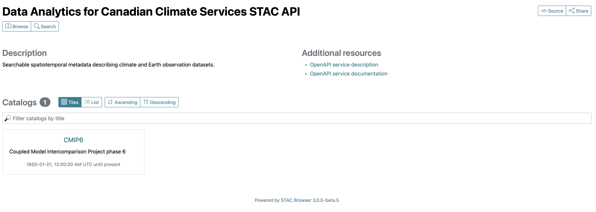
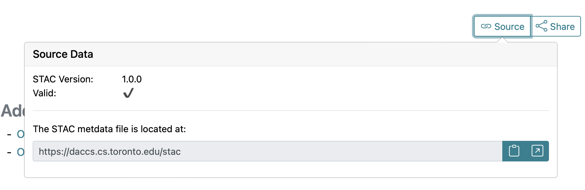
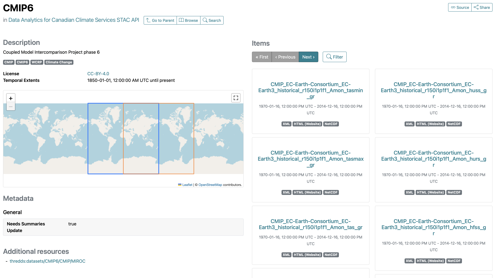
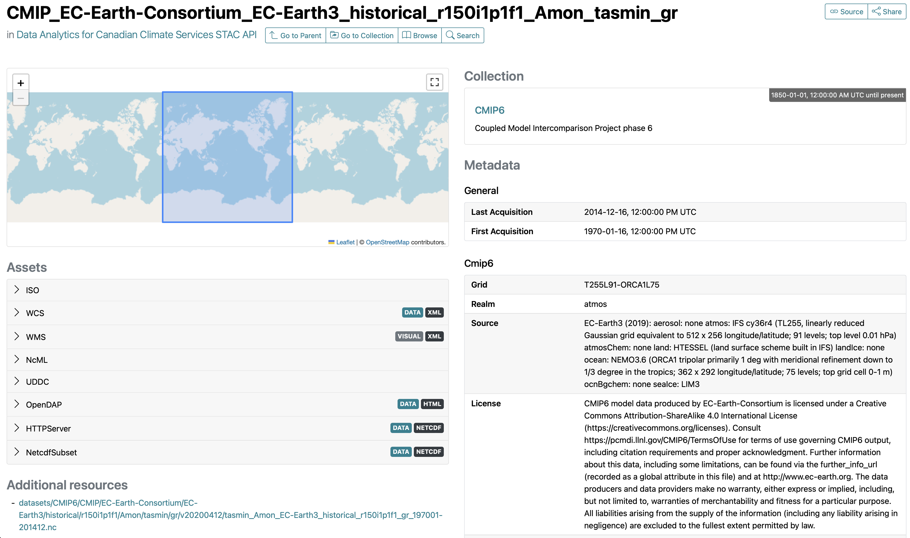
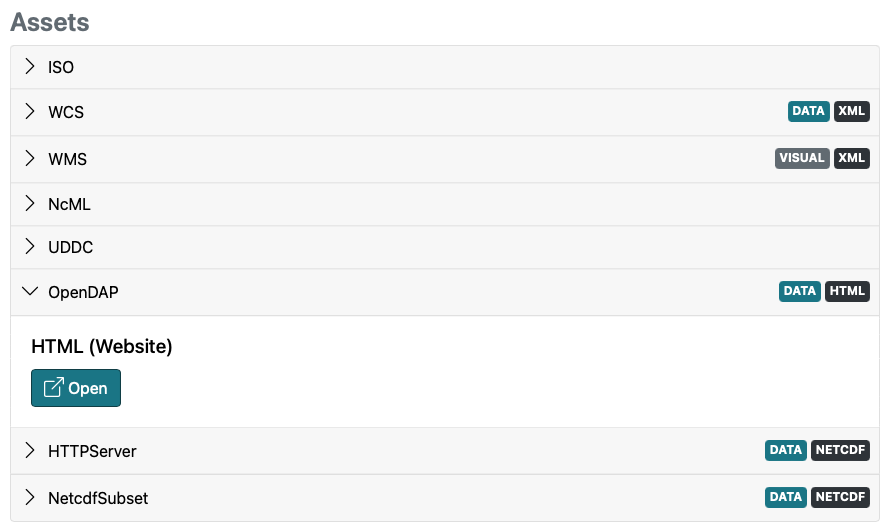
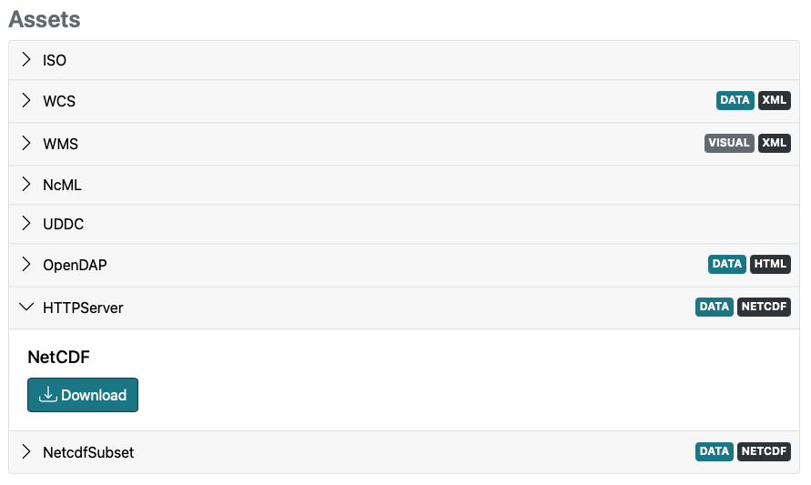

# Catalog access via STAC Browser

Each node in the Marble network include a GUI application called [STAC Browser](https://github.com/radiantearth/stac-browser) that allows you to 
explore the STAC catalog of data that is available on that node. This application is available at `https://host-url/stac-browser`, where
`host-url` is the URL of the Marble node. For example, for the Marble node 'Red Oak' available at 'https://daccs.cs.toronto.edu/',
the STAC Browser can be accessed at <https://daccs.cs.toronto.edu/stac-browser>.

In this tutorial, you will get an introduction to the STAC Browser, how to navigate within the Browser, how to perform search,
and how to retrieve links that allow you to the data via one or more protocols. At the end of the section, we discuss some limitations with the GUI, 
and programmatic way to interact with the STAC Catalog which is introduced in the [next section](pystac-client.ipynb).

(gui_overview)=
## GUI overview

In this tutorial, we'll use Red Oak node as an example. The concepts introduced here apply to all STAC Browsers. 
Start by navigating to the [STAC Browser on Red Oak](https://daccs.cs.toronto.edu/stac-browser) in a new tab; 
you should see a screen similar to what is shown below:

```{note}
It is important to keep in mind that the data catalog on Marble is continuously evolving and so the catalogs and items that you see 
may be different from that shown in this tutorial. However, the differences will only concern the 
content that is displayed and not the STAC Browser itself. If any future changes to the interface or the functionality of the STAC Browser renders 
aspects of this tutorial outdated, then the tutorial will be updated to reflect those changes.
```



1. The first thing you will notice is the bold text at the top left of the page. The STAC Browser uses this part of the page to display
    the "title" of the page that is displayed. In this case, since you are at the root of the STAC Catalog, the appropriate title is the
    _title_ field of the [root catalog](https://daccs.cs.toronto.edu/stac).
2. Immediately below the title is an area that will contain various navigation options for going back up the catalog hierarchy, as well as the "Browse" and "Search" tabs. Since we are at the
    root of the catalog no navigation options are presented here, and you only see the two tabs.
3. The "Description" section will display the description for the page you are on. In this case it is displaying the _description_ field
    of the [root catalog](https://daccs.cs.toronto.edu/stac).
4. The "Additional resources" section includes links to the description and documentation of the STAC API underpinning the catalog.
    If you are unfamiliar with what this means, then this is not meant for you and you can safely ignore the content.
5. On the top-right of the screen you always see the "Source" and "Share" tabs. Clicking on the Source tab will show you the version of 
    [stac specification](https://github.com/radiantearth/stac-spec) that is being used and whether or not the STAC data displayed on that
    page is valid according to the STAC standards and the [STAC extensions](https://stac-extensions.github.io) used (see image below). Crucially, it provides a quick access to the STAC endpoint 
    that contains the STAC metadata that is being parsed and displayed by the Browser in any given page.
    
6. Finally, in the lower part of the document, you will see the "Catalogs" section. This section "lists" all the 
    child STAC collections, or catalogs, on the node, and provides functionality to sort and search for a catalog by name. In the above image, 
    there is only only collection, namely the "CMIP6" collection.

```{note}
Although the root of a STAC catalog has to be a STAC ["catalog"](https://github.com/radiantearth/stac-spec/blob/master/catalog-spec/catalog-spec.md), 
there is very little practical difference, from a user's standpoint, whether the children of the root catalog (or their own children, _ad infinitum_) are
catalogs or STAC ["collection"](https://github.com/radiantearth/stac-spec/blob/master/collection-spec/collection-spec.md). In this tutorial, 
we'll always refer to any child catalog/collection as a "collection", and to the root catalog as "root catalog".
```

## Inspecting a collection
Clicking on a collection from the catalog root will take you into a new view that exposes important information about the 
collection. Here, we are using the "CMIP6" collection as an example.



1. The "title" section [discussed above](gui_overview) has now changed to the title of the collection.
2. Below the title, you now have a new "Go to Parent" tab that takes you to the parent catalog, which in this case is the root catalog.
3. The remainder of the page is laid out in a two-column format: on the left hand side you have information about the collection
    itself, while on the right hand side you see a list of the items in the collection.

    The left side contains various information about the collection in the following order:
    ```{attention}
    This section will be updated after changes to STAC.
    ```    
    - **Description** of the collection. Here it is "Coupled Model Intercomparison Project phase 6".
    - **Keywords** associated with the collection. Here the keywords are 'CMIP', 'CMIP5', 'WCRP' and 'Climate Change'.
    - **License** under which the data in the collection has been made available. Here the license is 'CC-BY-4.0'.
    - **Temporal Extents** of the data. The information presented here shows that the data starts at year 1850 and goes until present day.
    - **Spatial Extents** of the data are shown on the map. Here, we see two boxes that cover the whole earth, but with different longitude
        ranges. This is because the CMIP6 data is global, but some models publish data in the latitudinal range -180 to 180, while others
        publish in the range 0 to 360.
    - **Metadata** section shows the various metadata associated with the collection. 
    
    The right side tiles the items in the collection. Each item tile shows the item's unique ID, its temporal extents, 
    as well as the types of the asset files associated with the item.

## Inspecting a collection item

If you click on an item in the collection, you will be taken to a page about the item, which you can expect to look similar to 
that shown in the image below:

(item_view)=


You will immediately recognize several UI elements of the page from discussions in earlier sections. In 
particular, you will notice that the page is again organized in two columns, but unlike the collection view introduced in the last section, 
this time the metadata about the item is actually presented on the right side. This metadata is sub-divided into several 
categories; in the image above the categories seen are "General" and "Cmip6", but there is another category outside the view of the screenshot called "Data Cube". 
There will always be a "General" section and what other sections you see for an item, will depend on the STAC extensions that have been applied to that item. 
Here, the CMIP6 data uses the [cmip6](https://github.com/dchandan/stac-extension-cmip6) and the [Data Cube](https://github.com/stac-extensions/datacube) extensions, 
so metadata described by those extensions are included within 
their sections. The "General" section will always contain at least the temporal information about the item; any additional information 
displayed will depend on what the creator of the catalog decided to include.

## Retrieving access links
The left side in the [item view](item_view) displays the "assets" associated with the item. The definition of an asset is 
quite permissive, but you can think of it as a piece of information about the asset (say thumbnail vs actual data), or 
different ways to access the data. For this example CMIP6 item, the assets are the various means that you can access the
data. Selecting any asset type will reveal the access link. Two examples are shown in the images below:

**Access link for OpenDAP:**
To remotely open the file and access the data via the OpenDAP protocol, select the OpenDAP option, then right-click the Open button and copy the link. 
You can then use the link to open the file via `xarray` (refer to [documentation](https://docs.xarray.dev/en/stable/).)



**Access link to download the file:**
If you want to download the file to your local machine, then select the HTTPServer option and click the Download button:


## GUI Limitations
Often you might need several data files from a collection and manually searching for and copying the links to those files from the STAC Browser and then pasting them into your notebooks is not feasible, and a programmatic approach becomes immediately desirable. A more serious limitation of hardcoding access links from the Browser is that if the links for the data change, then your code will not function unless you manually update the code with the new links (which would be obtained from a manual search in the STAC Browser). This can lead to your code becoming less reproducible and can create problems for you down the line and problems for anyone with whom you've shared the code. For these reasons we recommend that you limit the GUI interface to (i) quickly exploring the catalog to see what data is available on the network, and (ii) for examining the properties of various collections. We suggest that you use the approach described in the [next section](pystac-client.ipynb) to retrieve access links to data on the Marble network. The approach described in the next section also allows for more advanced search mechanism that what is available via the Browser.