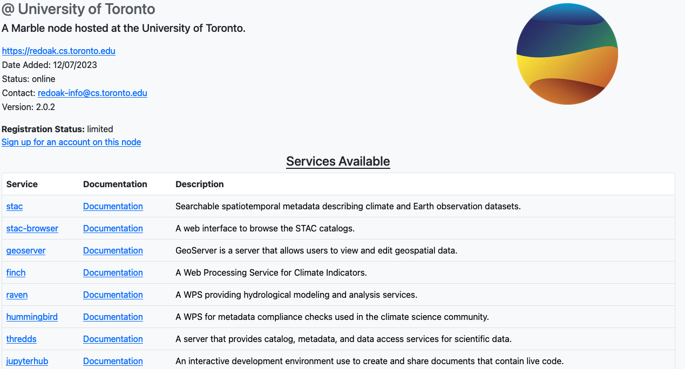

# Explore the Network


Information about the network can be found at [marbleclimate.com](https://marbleclimate.com) which maintains an up-to-date 
listing of all the nodes in the network and about the Marble project itself, such as its objective, organization and
management.

The site also provides information about the main services available on the Marble platform:

<!-- # TODO: update the tutorial links below as needed when they're added later -->

- [Interactive Development Environment](../../users/ide/ide.md)
- [Data Catalog](../../users/catalog/catalog.md)
- [Remote Processing Services](remote_processing.md)

## Explore the nodes

The Marble network is composed of interconnected nodes, each one running the same Marble node-management software called [Birdhouse](https://github.com/bird-house). This
software allows the nodes to communicate with each other and share data and services across the network. 

However, not every node is the same; different data is hosted on each node and each node may offer different computing 
services to its users. 

To explore the various options available in each node, first select a node from the 
[marbleclimate.com](https://marbleclimate.com) homepage. Your view might look like this:


Then, you will be taken to the node information page which contains information about the node's status on the network and
lists the services currently available on that node, as shown in the image below. 



The "Services available" table contains a short description of each service and a documentation link for additional information on
the service. Clicking the name of the service in the "Service" column will take you to the service's endpoint on the selected node.

```{note}
Note that not all services are open to the public, so you may have to log in before being able to access the service
endpoint.
```
