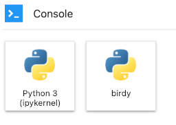

# Kernels and Dependency Management

## What is a Kernel?

Kernels in Jupyter are self-contained, program language specific processes that run independently.  
Having kernels configured and packaged for specific purposes gives the Jupyter environment some flexibility.
A kernel doesn't need to be configured to serve every purpose imaginable. Several kernels can be made, with none
of the dependencies for one kernel affecting the dependencies for another. If a kernel needs to be updated, changes can 
be made without affecting other kernels.  If it is no longer needed, it can be deleted without 
impacting other kernels.

Below are examples of kernels available on Marble.  These will be updated or changed to fit the needs of the users.


## How to install packages

```{warning}
If the server is reset all additional installed packages will be uninstalled.
```

The kernels created for Marble use Python as the programming language.  As such, the packages installed are Python packages.

Start off by clicking on the Console button for the kernel you want to install a package for.



This will open a Console tab where you will be able to enter commands at the bottom.  Execute the commands by using 
"Shift+Enter" on your keyboard.

### List the packages already installed

First, find out which packages are already installed. There are several ways to see the packages already installed in a 
kernel: `pip list`, `pip freeze`, `conda list`

#### `pip list`

`pip list` lists all the packages installed and its version.  It will also show the packages used for package management, such as `setuptools`.


#### `pip freeze`

`pip freeze` will list all the packages installed with the `pip` command and its version.  Sometimes it will also
show the VCS url if the package source is from a particular version control system.

The benefit of `pip freeze` is it outputs in the same format used by the `requirements.txt` file, a 
configuration file used for bulk package installation.  If you need to create a requirements file, use 
`pip freeze` with `>` to direct the output to a file.

```
pip freeze > /path/to/requirements.txt

```


```{note}
If `pip freeze` shows the VCS url instead of the version of the package, use `pip list` with the freeze format
```

```
pip list --format=freeze > requirements.txt
```

#### `conda list`

`conda list` will list all packages installed with the `conda` command and it's version, along with the build channel 
the package was installed from.  It will also show the kernel (environment) the packages are installed under. 

```{note}
You will only be able to use the `conda` command if you have [Anaconda](https://www.anaconda.com/) or one of its derivatives installed.
```


### Installing packages with a requirements file

A workaround to losing installed dependencies when the server shuts down is keeping a requirements file in the writable 
workspace folder.  When you need the dependencies for the project install the requirements listed in the file.

```
pip install -r /path/to/requirements.txt
```