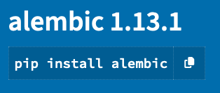

# Kernels and Dependency Management

## What is a Kernel?

Kernels in Jupyter are self-contained, program language specific processes that run independently.  This makes them 
useful for running Jupyter Notebooks and consoles with a specific programming language. 
A kernel doesn't need to be configured to serve every purpose imaginable. Several kernels can be made; with none of the 
dependencies for one kernel affecting the dependencies for another.

The flexibility of having kernels configured and packaged for specific purposes is passed on to the user, allowing you 
a lot of choice in the working environments available to you.  

Below are examples of kernels available on Marble.  These will be updated or changed to fit the needs of the users.


## Managing packages in a kernel

The kernels on Marble are created with a focus on climate science and data analysis.  As such, they are installed with 
packages commonly used for this purpose, such as Python packages or R.

For the purpose of this tutorial, Python will be used in the examples.

Start off by clicking on the Console button for the kernel you want to install a package for.


This will open a Console tab where you will be able to enter commands at the bottom.  Execute the commands by using 
"Shift+Enter" on your keyboard.

### List packages already installed

There are several ways to see the packages already installed in a 
kernel: `pip list`, `pip freeze`, `conda list`

#### `pip list`

`pip list` lists all the packages installed and its version.  It will also show the packages used for package management, such as `setuptools`.


#### `pip freeze`

`pip freeze` will list all the packages installed with the `pip` command and its version.  Sometimes it will also
show the VCS url if the package source is from a particular version control system.

The benefit of `pip freeze` is it outputs in the same format used by the `requirements.txt` file, a 
configuration file used for bulk package installation.  If you need to create a requirements file, use 
`pip freeze` with `>` to direct the output to a file.

```
pip freeze > /path/to/requirements.txt
```


```{note}
If `pip freeze` shows the VCS url instead of the version of the package, use `pip list` with the freeze format
```

```
pip list --format=freeze > requirements.txt
```

#### `conda list`

`conda list` will list all packages installed with the `conda` command and it's version, along with the build channel 
the package was installed from.  It will also show the kernel (environment) the packages are installed under. 

```{note}
You will only be able to use the `conda` command if you have [Anaconda](https://www.anaconda.com/) or one of its derivatives installed.
```


### Install packages individually

To install a package you need the package's name.  An excellent resource is the [Python Package Index](https://pypi.org/) (pypi).

For example, if you want to install Alembic, a package used for database migration, search the Python Package Index
for "Alembic".  The results of the *pypi* search includes the syntax of the install command for the package. 



In the console window type in the command and execute it.

If you want to install a specific version of a package, specify the version number you want using `==`.

```
pip install <package-name>==<version-number>
```


```{warning}
If the server is reset all additional installed packages will be uninstalled.
```

### Installing packages with a requirements file

A requirements file allows you to bulk install packages by running one command, rather than many individual install 
commands.

A handy workaround to losing installed dependencies when the server shuts down is keeping a requirements file in the writable 
workspace folder.  When you need the dependencies for the project, install the requirements listed in the file.

```
pip install -r /notebook_dir/writeable-workspace/requirements.txt
```