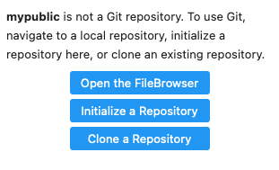
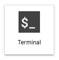
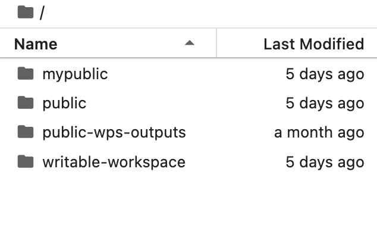
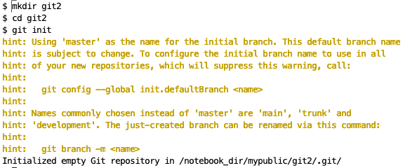
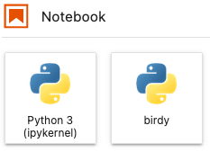
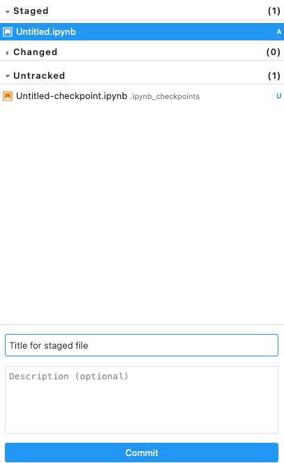
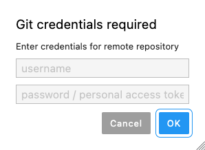
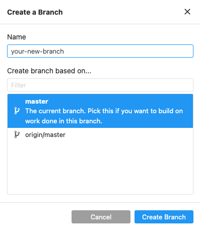
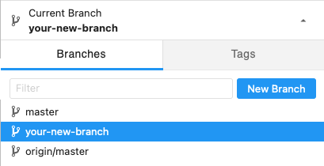

# Version Control

[_Version control_](https://en.wikipedia.org/wiki/Version_control) is a powerful way to organize, back up,
and share your research outputs and methodologies (code + data) with collaborators, or the public at large.
A version control system keeps track of a set of files and saves snapshots (i.e. _versions_, _commits_) of 
the files at any point in time. Using version control allows you to confidently make changes to your code 
(and any other files), with the ability to roll back to any previous state.


## Introduction to Git

Git is one of the most popular version control systems in use today. It has a native command line interface but there 
are also many third party desktop GUI clients that help make it easier to get started with Git.  A comprehensive list of 
several freely available Git clients is [available here](https://git-scm.com/downloads/guis).

Online Git services like [GitHub](https://github.com/), [GitLab](https://about.gitlab.com/), 
or [BitBucket](https://bitbucket.org/) allow you to store your repository online and access it 
anywhere with a free account. In this tutorial, you'll learn how to set up a remote Git repository to backup and share 
your work using GitHub, and how to configure Git locally, within your Marble Jupyter Lab environment to use that account.

(github)=
## GitHub

GitHub is one of the many online providers of free remote repository storage.  This section will cover how to work with 
remote repositories in a Github context.

### Creating a GitHub Account
To begin using Git you need to create a free account on GitHub. Go to the [GitHub](https://github.com/) website and follow the instructions to create an account. 

### Creating a Remote Repository

After creating your account click `Repository` at the top menu and then `New`:


Fill the form with details of the repository and then click the `Create Repository` button at the bottom of the page.

### Creating a Personal Access Token

A Personal Access Token is used to authenticate the user when pushing files to the remote repository

Go to [GitHub](https://github.com/) and log into your account.

Click on your account picture/avatar at the top left of the page, then navigate to **Settings** &rarr; **Developer Settings** &rarr; **Personal Access Token** &rarr; **Tokens(classic)**. On this page, select the dropdown box named `Generate new token` and select `Generate new token (classic)`. In the form that you are then presented with, choose an expiration date, check all the boxes, then click **Generate Token**. Copy the generated token.

```{note}
The Personal Access Token will be shown *only* when it is created.
```

Whenever you push a commit, use the personal access token in place of a password when ask for your GitHub credentials.

```{warning}
Storing personal access tokens or SSH keys in a JupyterLab container poses security risks.  It is recommended to store authentication credentials on your personal computer.
``` 

### Creating a Pull Request
A Pull Request is created when you want to merge your changes into the **main** branch.  It also gives you a chance to let others know of the changes you made and ask them to review your changes.

A Pull Request is created from the GitHub site.  After logging into [GitHub](https://www.github.com), you may see a notification about a branch making recent pushes if you pushed recently.


Click the `Compare & pull request` button.  

If you don't see a notification, click the `Pull Request` menu button and then the `New Pull Request` button on the following page.

  

You'll be taken to the `Open a pull request` page.

Here, make sure the `base` is set to **main** and the `compare` is set to the branch you want to compare the **main** branch with.


Fill out the form and provide a title and description of the changes made.  

If you have someone who can review your pull request, on the right side of the screen click the cog icon under the `Reviewers` section, and select their name.


Then click the `Create Pull Request` button.

### Merging Your Branch
Merging branches is done on the GitHub site.

After your Pull Request has been approved (and reviewed, if needed), the `Merge` button will turn green


## Setting up Git on Marble

Now that you have setup a remote repository which you can use to version control your workflow, backup, and share your
work with others, it is time to configure Git in your IDE environment on Marble. You need to complete this step because 
in this step you will configure the local "git" program that will actually do the version control work for you and you will configure 
it to access your remote repository.

```{note}
If you have not already done so, go to the [](github) section and create a remote repository first.
```

### Creating Remote Repository Account

To use Git with a remote repository you will need to create an account and then create a repository there.

There are many free options such as [GitHub](https://github.com/) or [BitBucket](https://bitbucket.org/).

This tutorial uses GitHub to demonstrate how to set up a remote repository.  
To see how to set up a GitHub account, see the GitHub section.

### Setup a New Git Repository Using the Graphical User Interface
 
If there is no Git repository set up you will see the following:



### Creating a Local Repository

```{note}
The repository needs to be in a folder with write permissions enabled.  
```

Click `Initialize Repository` to create a Git repository in the current folder. 


```{note}
The current folder is the last one shown in the folder breadcrumb.
 
 
 
For example, if `git` is the last one in the breadcrumb, then `git` is the current folder selected 
```

Once it is done the left sidebar will show the Git interface.  This is where you will see changes to files in the Git folder.


### Adding a Remote Repository

You can optionally add a remote repository.

Adding a remote repository allows you to store your work online at GitHub and access it anywhere.

From the menu click `Git` and then select `Add Remote Repository`.  Enter the URL of the repository you created on 
GitHub into the `Add Remote Repository` dialog box.  Click `OK` 


### Cloning an Existing Repository

Cloning a repository is another way of adding a remote repository. Cloning creates a copy of an existing remote repository in your local folder.

Find a repository online you want to clone and copy the URL of the repository.

Create a new folder or navigate to the folder you want to keep this repository in.

Click the `Git Clone` button in the breadcrumb menu


```{note}
This button only becomes active when you are in a folder that does not contain a git repository.
``` 

Paste the repository URL into the dialog box. Click `Clone`.  The online repository's files will be copied into the local repository folder.


### Setup Git Repository Using the Jupyter Terminal

Click the Terminal button to start a Terminal session.




Check to see that you are in the default folder by executing the `ls` command.

```
ls
```

If you are in the default folder you will see the following subfolders available to you:


Navigate into the `notebook_dir` directory.

```
cd /notebook_dir
```
You should see the user folders available to you.  These are the same folders seen when clicking the `File Browser` icon.




Navigate into the `writable-workspace` folder, then create a new folder here and then navigate into it.

Substitute `your-folder-name` with a new folder name. 

```
cd writable-workspace

mkdir your-folder-name

cd your-folder-name
```
Initialize your Git repository

```
git init
```




### Adding a Remote Repository
You can optionally add a remote repository.

Adding a remote repository allows you to store your work online at GitHub and access it anywhere.

```
git remote add origin url-of-your-git-repository
```

## Using Git with the Graphical User Interface
By default when you create a new repository you will be using a default branch, which is usually named **main**.
This is the main branch where the initial work files will be pushed to and also where the final work version will be.

It is good practice to create work branches from the main branch where all the changes to your work will be done.
Once the changes are complete they can be pushed and merged with the main branch

### Making Your First Commit

Start by creating a file.  In this example a Jupyter Notebook file is created by clicking one of the Jupyter Notebook buttons in the launcher.



When the file is created or altered it will be seen under the `Untracked` section in the Git sidebar.


### Staging a File
Staging a file means getting the file ready to be committed and pushed to the remote repository.  
There are two ways to do this.

1. Hover the mouse over the file and click the plus `+` symbol next to it.  This **Stages** the file.

   

2. Right-click the file and select `Stage`.

   

   The file will now appear under the `Staged` section.

   

### Making a Commit

Select the file and fill in the Title/Summary for the commit.  It should be short and descriptive.  
It can be as simple as "Updated Untitled.ipynb" or more specific, such as "Added visualization for rainfall 2022".

A description is recommended but is not required.



When done click the `Commit` button below the commit description.  If successful you will see a `Committed changes` status pop up in the lower right corner.


### Pushing a Commit

Making a commit sets a "flag" in the progress of your work that shows what has been done at certain points. Pushing a commit moves these changes to the remote 
repository where they can be merged with the main branch.  Up to now no branches have been made.

Click the `Git` menu and `Push to Remote`


Enter in your login credentials.  For the password enter your Personal Access Token.  Click `OK`.




If successful you will see a `Successfully pushed` status pop up in the lower right corner.


### View Commit History
To see all your past commits click the `History` tab in the `Commits` section under `Current Branch`


### View the Changes Made to a File Between Versions

There are several ways to view the changes made between versions of a file.

1. Right-click on the file and select `Diff`.  

   

2. Click the `Diff` button.

   

3. Enable the double-click shortcut for viewing a `Diff`.  

   From the `Git` menu select **"Double click opens diff"**.  A checkmark will appear to show this option is enabled. 
Then double-click on the file.

   

The `diff` screen of the file will open and show the changes made to the file.  On the left is the `HEAD` panel 
and on the right is the `WORKING` panel. 

`HEAD` is the old version of the file.  Areas where changes were made are 
highlighted in red.  If additions were made there will be green slashes on top of the red highlight.  
If there were deletions they will be highlighted in darker red on top of the red highlight. 

`WORKING` is the new version of the file.  Areas where changes were made are 
highlighted in green.  


### Undoing Changes
Undoing changes can mean several things:

1. `Discard` - Undo changes made to the current unstaged file

   An unstaged file means this file has never been committed.  It has likely never been pushed to the remote repository and 
it will not be seen in the commit history. 

   To `Discard` the current changes, right-click on the file while it is in the `Changed` section. Then click `Discard`.

   

2. `Revert` - Undo past changes made to a file in the commit history

   To `Revert` past changes click the `History` tab.  Then click the title or the down arrow of the 
commit you want to revert. This will expand the commit information, and you will see additional buttons.

   

   Then click the curved arrow to revert the changes for that particular commit.

   

3. `Hard Reset` - Undo all changes made after a certain point

    Undoing changes made after a certain point means resetting the commit history to the chosen commit.
Click the `History` tab.  Then click the title or the down arrow of the 
commit you want to reset to. This will expand the commit information, and you will see additional buttons.

   

   Click the button that has a clock inside a curved arrow.

### Stashing Files

Stashing a file means to temporarily store files you're working on so the changes made to them will not affect other files, 
and changes to other files will not affect the working file.  Stashing is typically done before switching branches, so 
the changes from other branches will not overwrite changes in files you are currently working on.

Currently, there is no mechanism in the GUI to stash files.  Files can only be stashed from the Terminal.  
Similarly, files can only be retrieved from the Terminal.

[Stash Files From Terminal](content:references:stash-terminal)

Once the command is run all files listed under `Changed` will be moved to the `Stash` and will not be seen. 


### Creating a Branch

Click the down arrow in the `Current Branch` section in the Git sidebar.  It will reveal the `Branches` window and show all the created branches.

Click the `New Branch` button.


Fill out the form and input a branch name, and click which branch to base the new branch off of.  After that click `Create Branch`.

It is good practice to not use spaces or special characters in the branch name other than dashes.




Git will automatically switch you into the new branch.  Your newly created branch will be shown under `Current Branch` and be in the list of branches.  




### Switching Branches

```{note}
You can only switch branches when you have no conflicts in files between the branches.
```

To switch branches simply click another branch listed under the `Branches` section.

```{note}
You can only switch to another local branch.  Branches with the `origin` prefix are remote branches and cannot be switched into.
``` 


## Using Git with the Terminal

In this section are some useful Git commands.  For more in-depth information take a look at the 
[official Git documentation](https://git-scm.com/doc).

### Set Up Your Git Identifier

When you set up your Git Identifier your username and email will be shown with each commit you make.
If you are working in a team this will show who made a certain commit.

```
git config --global user.name "Your Name"
git config --global user.email "email@email.com"
```

### Staging a File

A file can be staged whether you are in the same directory as the file or not. 

To stage a file when you are in the same directory as the file, you use the command with only the filename.

```
git add <filename>
```

To stage a file when you are in a different directory as the file, you use the command with the folder path to the file.

```
git add /folder/path/to/file/<filename>
```

### View Status

If you have multiple files staged and ready to commit you can see the list by using `git status`.

```
git status
```


### Making a Commit

Add a brief descriptive message about your commit.

```
git commit -m "your brief commit message goes here"
```

### Pushing a Commit

After your commit is complete, push it to the remote repository.

```
git push
```

### Pushing a Commit to an Existing Remote Repository
If you want to push to a specific remote repository specify the name of the repository with the `-u` flag.
`-u` is the same as using the full command `-set-upstream`.

```
git push -u remote-repository-name
```

You can also specify a specific branch to push to.

```
git push -u remote-repository-name remote-branch-name
```

### View Commit History

To see all the commits made in a repository use the `log` command.

```
git log
```

### View the Changes Made Between Versions

To view a comparison of the changes between versions of the same file run the `diff` command.

```
git diff
```

### Undo Changes

1. Undo changes in a single file, but keep it staged:
   ```
   git checkout <commit tag> <filenames>
   ```

2. Revert changes in a single file:
   ```
   git revert <commit tag>
   ```
   
3. Reset changes in a single file, but keep it unstaged:
   ```
   git reset <commit tag> <filenames>
   ```
(content:references:stash-terminal)=
### Stashing Files

Running the `stash` command will stash all files that have changes made to them.  These changed files will then not 
interfere with other git operations such as switching branches.

```
git stash
```

You can also run the `stash` command if you are not in the same directory as the files.

```
git stash -- folder/path/to/file
```

To see a list of stashes you have made: 

```
git stash list
```

To see the contents of your most recent stash run:

```
git stash show
```

To resume working on your stashed files you will need to get them out of the stash.  
Run the following command and you will see them under the `Changed` section.

```
git stash pop
```

```{note}
This will only get the most recent stash.
```

### Creating a Branch

```
git branch <new-branch-name>
```

### Creating a Branch That Tracks a Remote Branch

A "tracking" branch is a local branch that has a direct connection to a remote branch.  This allows you to use
simple commands such as `git push` without any specifying commands.  Git automatically knows which server and branch
to push to.

To track a remote branch use the `track` command.

If you want the new local branch to have the same name as the remote branch use the following command.

```
git checkout --track origin/<remote-branch-name>
```

If you want to specify a different name for the local branch use the following command.

```
git branch --track <new-local-branch-name> origin/<remote-branch-name>
```

### Switching Branches

```{note}
You can only switch branches when you have no files that can cause a conflict between branches.
``` 

Switch branches by checking out the branch.  Replace *<branch-name>* with the branch you want to switch to.

```
git checkout <branch-name>
```

```{note}
You can only switch to another local branch.  Branches with the `origin` prefix are remote branches and cannot be switched into.
``` 

## Git Best Practices

### Organize with Branches

Create a branch for each issue you're working on.  Have one for data ingestion, one for visualization, and one for bug fixes.

This keeps the workflow clean.  If something went wrong you know which branch the changes came from.

### Write Descriptive Commit Messages

A good commit message documents the changes made in the commit so that when looking through the commits you can see the direction your work is going in.

### Commit finished tasks only

Each commit should be a completed logical chunk of the overall workflow.  If you need to commit often, split up the workflow into smaller tasks.

### Test code before committing

Related to only committing finished tasks, test your code to ensure it does what it is intended to do before committing.
